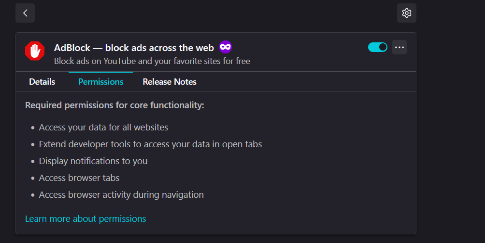

## Task 7: Identify and Remove Suspicious Browser Extensions

**Objective:** Identify and remove unnecessary or suspicious extensions to improve browser security.

---

### Tools Used:

- **Browser:** Firefox (Latest Version)
- **Method:** Manual inspection of installed extensions via `about:addons`

---

### Documented Extensions (with Screenshots)

---

### 1. **AdBlocker**

- **Screenshot:**

- **Permissions:**
    - Access to all websites
    - Blocking and modifying page content
- **Notes:**
    - Extension from a trusted source (e.g., uBlock Origin or Adblock Plus).
    - Active user base and frequent updates.
    - **Safe** if verified to be a well-known variant.

---

### 2. **FoxyProxy**

- **Screenshot:**
    
    
    
    
    
- **Permissions:**
    - Modify proxy settings
    - Read browser history (if configured)
- **Notes:**
    - Popular among developers and testers.
    - Used responsibly for switching between proxy configs.
    - **Safe** — just ensure it's the official one by **Eric H. Jung**.

---

### 3. **KeePassXC**

- **Screenshot:**

- **Permissions:**
    - Communicates with local KeePassXC desktop app via native messaging
    - No web access or suspicious permissions
- **Notes:**
    - Open-source, minimal risk.
    - No known data leak vulnerabilities.
    - **Safe** — part of a secure password management workflow.

---

### 4. **Wappalyzer**

- **Screenshot:**

- **Permissions:**
    - Read and analyze page content to detect technologies
    - Minimal data sent to remote servers (check policy)
- **Notes:**
    - Commonly used for tech reconnaissance.
    - Clean history, active development.
    - **Safe** — though you should disable it when not in use for privacy reasons.

---

### 🧹 Final Summary

| Extension | Status | Action Taken | Remarks |
| --- | --- | --- | --- |
| AdBlocker | ✅ Safe | None | Verified known version |
| FoxyProxy | ✅ Safe | None | Trusted source and used frequently |
| KeePassXC | ✅ Safe | None | Official plugin, no privacy risks |
| Wappalyzer | ✅ Safe | Disabled If not used | Used responsibly for tech lookup |

---

### 💡 Recommendations:

- Consider **disabling Wappalyzer** when not in use to reduce passive tracking.
- Ensure all extensions are **updated regularly** and remain from official developers.
- Continue regular audits of extensions, especially after installing new software.